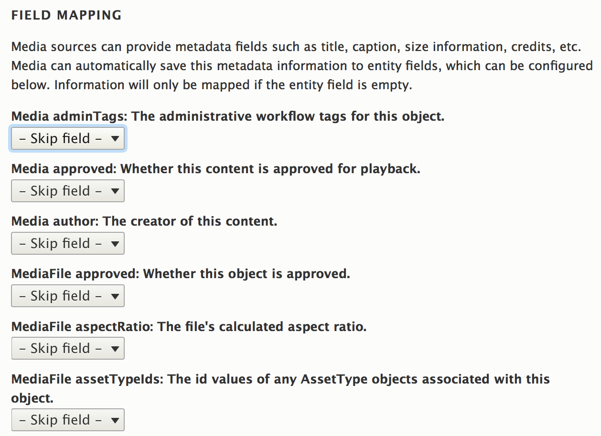

# This project is now archived and continues on at https://www.drupal.org/project/media_mpx

# Media mpx for Drupal 8

<!-- START doctoc generated TOC please keep comment here to allow auto update -->
<!-- DON'T EDIT THIS SECTION, INSTEAD RE-RUN doctoc TO UPDATE -->
**Table of Contents**  *generated with [DocToc](https://github.com/thlorenz/doctoc)*

- [Requirements](#requirements)
- [About the mpx name](#about-the-mpx-name)
- [Metadata mapping support](#metadata-mapping-support)
- [Video ingestion](#video-ingestion)
- [Thumbnail integration](#thumbnail-integration)
  - [Handling thumbnail errors](#handling-thumbnail-errors)
- [Caching of mpx responses](#caching-of-mpx-responses)
- [Media access and availability calculations](#media-access-and-availability-calculations)
- [Limiting results during an mpx import](#limiting-results-during-an-mpx-import)
  - [1. Altering import mpx queries](#1-altering-import-mpx-queries)
  - [2. Altering ingested mpx objects](#2-altering-ingested-mpx-objects)
- [Custom field support](#custom-field-support)
- [Migrating from Media: thePlatform mpx](#migrating-from-media-theplatform-mpx)
- [Interacting with the Video Player](#interacting-with-the-video-player)

<!-- END doctoc generated TOC please keep comment here to allow auto update -->

[](https://circleci.com/gh/Lullabot/media_mpx/tree/8.x-1.x) [](https://codeclimate.com/github/Lullabot/media_mpx/maintainability) [](https://codeclimate.com/github/Lullabot/media_mpx/test_coverage)

This module integrates [mpx for PHP](https://github.com/Lullabot/mpx-php) with
Drupal 8's Media API.

## Requirements

* Composer to fetch the various libraries this module is built on.
* Drupal 8.5+
* PHP 7.0+

## About the mpx name

mpx is not an acronym, and is used by thePlatform with capitals in all-caps
sentences. This makes for some odd displays in Drupal, that generally expect
title case or sentence case. When referring to mpx within the user interface
and in strings, use lower case such as 'the mpx User entity'.

## Metadata mapping support

This module supports the following mappings with Drupal's media module:

* Scalar properties (like strings, numbers, and dates) on mpx objects like
  Media and Players.
* Scalar properties on the _first video MediaFile_ attached to an mpx Media
  object. This includes duration, bitrate, format, and so on.
* Scalar properties on custom fields that have a corresponding Custom Field
  class implementation.



## Video ingestion

This module includes two Drush commands to import content from mpx:

- `drush media_mpx:import <media type>` will import all content for a given media
  type. Existing content previously imported into Drupal will be updated if any
  mapped fields are empty, matching Drupal's core behaviour.
- `drush media_mpx:listen <media type>` will listen for mpx notifications for
  the given media type. This command will not actually update any content in
  Drupal. Instead, it will deduplicate notifications and place them into a
  queue for later ingestion. By default, these updates will be processed with
  cron. However, to improve import performance, consider running a separate
  `drush queue-run media_mpx_notification` job to process imports separately
  from cron.

## Thumbnail integration

When an mpx media item is saved, Drupal will download the default thumbnail so
it can be used with image styles.

Consider enabling "Queue thumbnail downloads" in your media type configuration,
depending on your editorial workflow and the number of videos created each day.
When this setting is off, expect an additional performance hit of a few hundred
milliseconds when importing videos. One advantage of queueing thumbnails is
that [Concurrent Queue](https://www.drupal.org/project/concurrent_queue) can be
used to download thumbnails in parallel. Until thumbnails are downloaded, a
placeholder will be used in admin listing (and on your site, if videos are
published automatically).

### Handling thumbnail errors

If an error occurs while downloading a thumbnail, Drupal will use the default
thumbnail for a video. It will not try again later to download the correct
thumbnail. To work around this, we replace Drupal's thumbnail downloader with
our own. If the patch from
[Allow a queue item to be postponed](https://www.drupal.org/project/drupal/issues/1832818#comment-12827934)
is applied, individual items will be sent to the end of the queue to be tried
later. Otherwise, queue processing will be suspended until the next cron or
queue run.

Note that there is not a corresponding Drush patch yet for it's `queue:run`
command. If media thumbnails are processed with that command, do not use the
above patch, or consider contributing a similar patch to Drush itself.

## Caching of mpx responses

Unfortunately, mpx returns `Cache-control: no-cache` headers in every request.
For most Drupal sites, cached video data is fine to use and expected given that
the data is copied into media entities. By default, all requests loading a
single data object (like an mpx media item) are cached. When using any of the
provided services to load mpx data (such as `media_mpx.authenticated_client_factory` or
`media_mpx.data_object_factory_creator`), assume data will be cached. To force
a fresh request, pass in an appropriate `Cache-Control` header, such as:

```php
$factory->load('http://data.media.theplatform.com/media/data/Media/2602559', ['headers' => ['Cache-Control' => 'no-cache']]);
```

Note that this will incur a significant performance hit on the order of 500ms
or more, so use this option sparingly and rely on cached data where possible.

## Media access and availability calculations

Access to an mpx media entity is calculated using the mpx available and
expiration dates. By default, after a site cache clear those videos will
need to be re-fetched from mpx to have up-to-date availability dates. To
improve performance, map the available and expiration dates to Date / Time
fields. If available, those fields will be used to calculate access
permissions. For details, see the
[MediaAvailableAccess](src/Access/MediaAvailableAccess.php) class.

## Limiting results during an mpx import

Sometimes sites will want to add code to alter how data is imported into
Drupal. For example, an mpx account could have a custom field to indicate if
a given asset should be ignored by Drupal. Since ignoring assets is a common
use case, we can't use the normal entity hooks.

Sites wishing to limit the mpx data that is imported will need to implement two
event subscribers.

### 1. Altering import mpx queries

First, it is a best practice to limit the returned data from mpx where
possible. This is possible by subscribing to the
`\Drupal\media_mpx\Event\ImportSelectEvent::IMPORT_SELECT` event and by
altering the `ObjectListQuery` object attached to that event. See
[\Drupal\media_mpx_test\Event\ImportSelectSubscriber](test_modules/media_mpx_test/src/Event/ImportSelectSubscriber.php)
for an example. To add your own in a custom module, create a similar class and
add the following in your module's `mymodule.services.yml`.

```yml
services:
  mymodule.import_select_subscriber:
    class: Drupal\mymodule\Event\MyImportSubscriber
    tags:
      - { name: event_subscriber }
```

### 2. Altering ingested mpx objects

Unfortunately, mpx has no ability to filter results in notifications. While the
above subscriber will work for initial imports, it will not work for
notifications.

During an import, an `ImportEvent` is dispatched with references to each media
entity that would be created or updated by the import.

Note that this event should _not_ be used for mapping mpx data to Drupal
fields. Instead, use the mapping functionality in the media type configuration.

See
[\Drupal\media_mpx_test\Event\ImportEventSubscriber](test_modules/media_mpx_test/src/Event/ImportEventSubscriber.php)
for an example implementation.

## Custom field support

Custom fields are defined in mpx and allow for additional data to be attached
to media and other mpx objects. Custom fields are grouped by _namespaces_ and
each object can have custom fields from any number of namespaces.

Out of the box, custom fields will not be available on loaded mpx objects.
If custom fields are used in mpx, but are not required in Drupal, then you
can leave things as is and each set of custom fields will be represented by the
`\Lullabot\Mpx\Normalizer\MissingCustomFieldsClass` class.

To integrate custom fields:

1. Follow the steps at https://github.com/Lullabot/mpx-php to generate the
   initial custom fields classes. For example, if you wish to include the
   classes in the `mysite_mpx` module, run:
   `bin/console mpx:create-custom-field '\Drupal\mysite_mpx\Plugin\media_mpx\CustomField' 'Media Data Service' 'Media' '1.10'`
1. Rename the classes to something that is reasonable for each set of data they
   contain.
1. Move the classes to `src/Plugin/media_mpx/CustomField` in your custom
   module.
1. Clear caches. When loading a Media item, your classes will be returned when
   calling `getCustomFields($namespace)`, where `$namespace` is the mpx
   namespace of your fields.

## Migrating from Media: thePlatform mpx

Migrations should be run with Drush, using the
[migrate-tools](https://www.drupal.org/project/migrate_tools) module.

Currently, Users and Accounts are migrated from mpx Accounts in Drupal 7. As
migrating passwords would require access to the Drupal 7 private key, they
are not migrated. Most Drupal 8 sites should inject passwords through
`settings.php` or environment variables. For example, if the migrated user
machine name is `mpx_lullabot`, add the following to `settings.php`:

```php
<?php

$config['media_mpx.media_mpx_user.mpx_lullabot']['password'] = 'SECRET';
```
## Interacting with the Video Player

The video player for media objects will be rendered as an iframe which in
turn utilizes a player from mpx. If this iframe needs to be interacted with
through Drupal behaviours the following classes are added to the iframe.
 - `mpx-player`
 - `mpx-player-account--<Account Machine Name>`

Additional classes as well as other HTML attributes can be added to the iframe
by modifying the render array for the `media_mpx_iframe` template.
